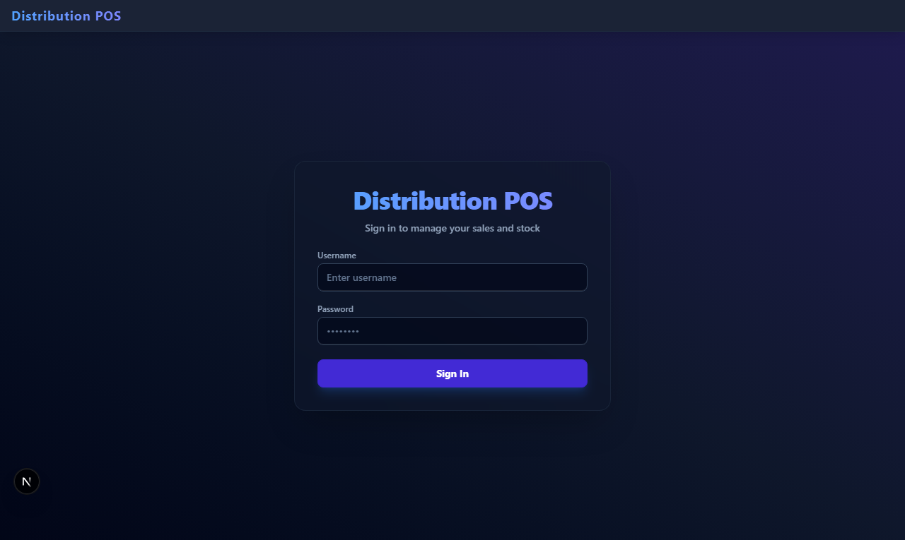
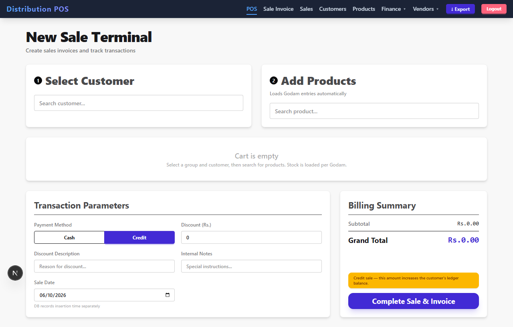
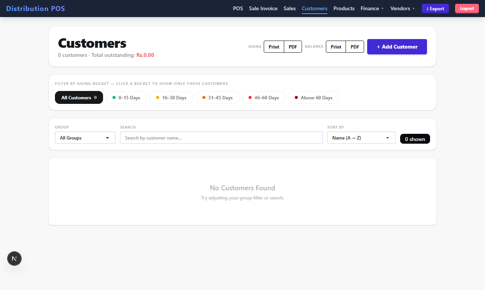
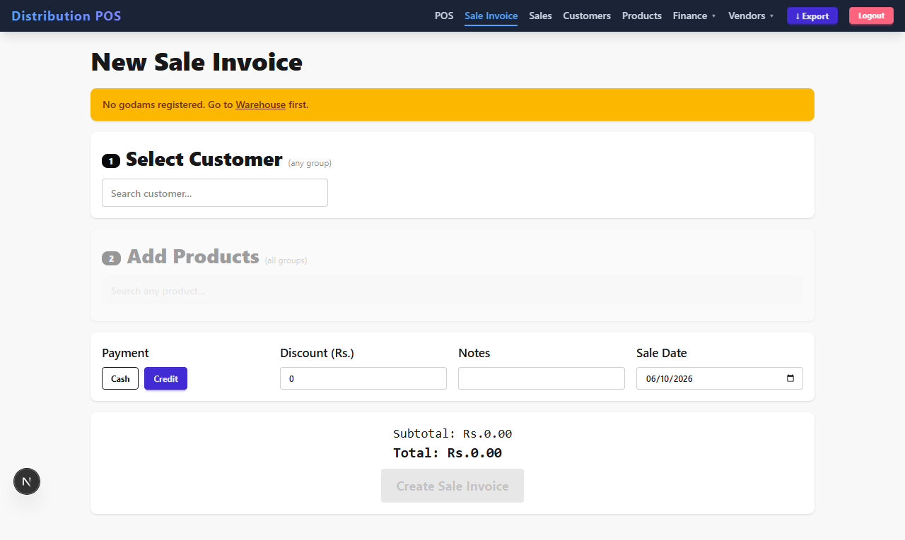
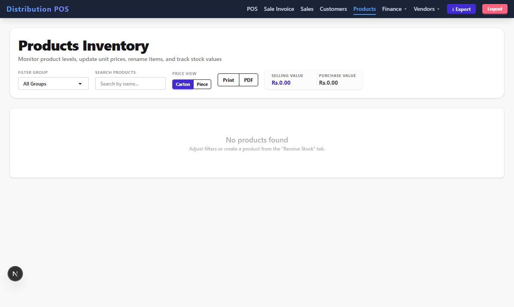
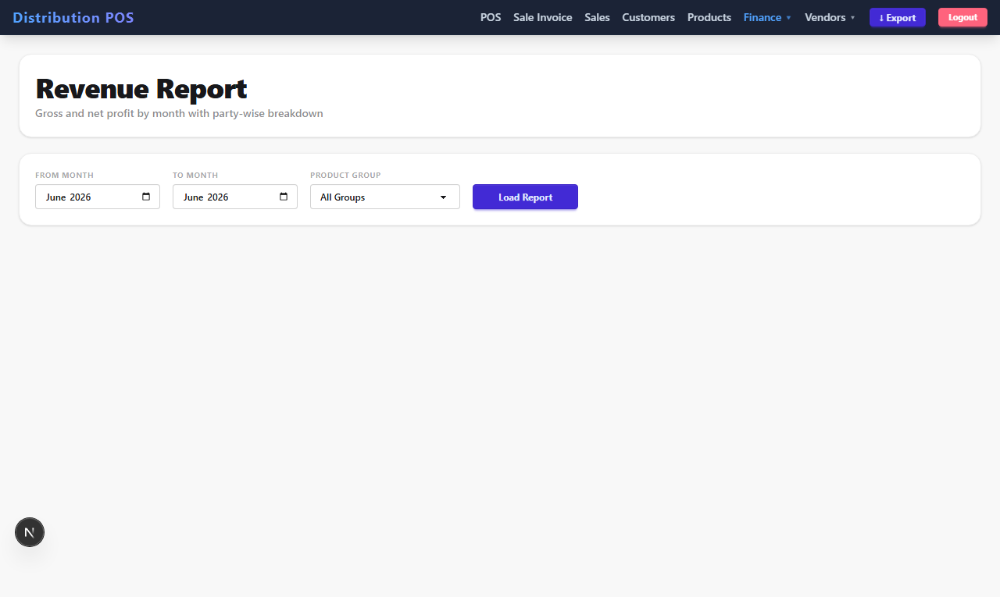

# POS Test Automation

End-to-end and API test automation for a real **Next.js 16 Distribution POS / wholesale ERP** — built with **Cypress**, **Playwright**, and **Postman/Newman**. Three layers, one suite, ~120 tests across 14 business domains.

> The application source is **not** in this repo — this repo is the **test suite** only. It runs against the POS app (Next.js + Supabase) running locally.

---

## Why this repo exists

It's a worked example of testing a non-trivial, auth-gated, money-handling web app the way a QA/SDET would in production: the same flows tested with **two browser engines**, plus **API-level** and **real-DB** validation, with **HTML reports** and **screenshots**. Skim the [skills](#skills--techniques-on-display) below, then read the [techniques](#key-techniques-explained) for the interesting bits.

---

## Skills & techniques on display

| Area | What's demonstrated |
|------|---------------------|
| **Cypress** | full UI E2E, `cy.intercept` stubbing, custom commands, `cy.session`, data-driven tests, `cy.request` API checks |
| **Playwright** | `@playwright/test`, fixtures, `page.route` stubbing, `waitForRequest` payload assertions, trace/video/screenshot artifacts, auto web server |
| **Postman / Newman** | collection + environment, chained requests, cookie-jar auth, test scripts, **htmlextra** HTML report, CI-runnable |
| **Auth testing** | bypassing JWT middleware by **minting valid tokens** (no seeded user); role-based authorization (manager vs cashier); real login flow |
| **Test design** | test pyramid, smoke/regression/happy/sad/edge tagging, [a full use-case catalog](cypress/E2E-TEST-PLAN.md), positive + negative + authz coverage |
| **Backend validation** | contract tests, **business-rule** assertions (computed balances, aging buckets), **self-cleaning** create→verify→delete against a live DB |
| **Determinism** | network stubbing for repeatable UI tests; minted-token auth so specs run offline with no DB |
| **TypeScript** | typed specs, typed custom commands/fixtures, signing JWTs with Node `crypto` |
| **k6** | load & performance testing with ramping VUs, SLO thresholds (`p(95)`, error rate), HTML report |
| **Docker** | containerized runners (Playwright/Newman/k6) via `docker compose`, reaching the host app |
| **Reporting** | **Allure** + Playwright HTML + trace viewer, Newman htmlextra, k6 HTML, Cypress video/screenshots |
| **CI/CD** | GitHub Actions: typecheck on push, Allure build + **GitHub Pages** publish of all reports |

---

## The application under test (context)

A wholesale **Distribution POS** — POS terminal, sale & purchase invoices, customers/suppliers with ledgers & aging, multi-warehouse (godam) stock, payments, expenses, price adjustments, and revenue reporting.

- **Stack:** Next.js 16 App Router · React 19 · TypeScript · Supabase · DaisyUI.
- **Auth:** an httpOnly `token` JWT (HS256). `middleware.ts` guards every route — no valid token → pages redirect to `/login`, APIs return 401.
- **Roles:** `manager` (everything) and `cashier` (sales + read-only inventory).
- **Money model:** prices are entered per **carton** in the UI but stored per **piece** (`carton ÷ pieces_per_carton`). This conversion is a prime bug magnet — so the suite asserts the exact converted payloads.

---

## Repo layout

```
cypress/
  e2e/                 # 15 spec files (Login, auth, customers, pos, sales, …)
  support/commands.ts  # cy.login / cy.loginAsManager / cy.authAs / cy.dataCy
  E2E-TEST-PLAN.md     # the full use-case catalog (every domain, tagged)
cypress.config.ts      # baseUrl + mintToken Node task (HS256 via crypto)

playwright/
  *.spec.ts            # same coverage, Playwright engine
  utils/auth.ts        # mintToken / authAs / loginReal
  utils/stub.ts        # page.route JSON stub helper
  visual-tour.spec.ts  # generates docs/screenshots/*.png
playwright.config.ts

postman/
  POS.postman_collection.json    # login → CRUD lifecycle, self-cleaning
  POS.postman_environment.json

k6/
  login-load.js        # ramping-VU load test on /api/login + SLO thresholds
  api-flow.js          # authed read flow (login → list endpoints)

Dockerfile             # Playwright image (Node + browsers)
docker-compose.yml     # playwright / newman / k6 runners → host app
.github/workflows/     # typecheck.yml (CI) + pages.yml (build Allure, deploy reports)

docs/
  index.html           # GitHub Pages landing → links every report
  screenshots/         # showcase images (generated by `npm run tour`)
  reports/             # Playwright + Newman + Allure + k6 HTML reports
TESTING.md             # condensed run reference
```

---

## Key techniques explained

### 1. Minting a JWT to bypass auth (run offline, no DB user)
Every page sits behind JWT middleware, so a test can't just `visit('/customers')`. Instead of seeding users, the suite **signs its own valid token** with the app's `JWT_SECRET` (identical HS256 to the app) and sets it as the `token` cookie. Middleware accepts it → the page loads. No database required.

- Cypress: a Node `task` in `cypress.config.ts` signs the token; `cy.authAs("manager")` plants it.
- Playwright: `playwright/utils/auth.ts` → `authAs(context, "cashier")`.

Because API authorization only checks the token's **role**, a forged `cashier` token is enough to prove `403` paths — without ever creating a cashier account.

### 2. Network stubbing for deterministic UI tests
UI specs stub the data APIs (`cy.intercept` / `page.route`) so assertions like "2 customers shown" never flake on changing data, and tests run with just the app up — no DB. Each spec then asserts both the **rendered UI** and the **request payload the UI sent**.

### 3. Testing the money math (carton ↔ piece)
The highest-value regression guard: enter a carton price in the UI, assert the API receives the per-piece value. Example (sale invoice): carton `120`, `pieces_per_carton = 12` → payload `sale_price: 10`. Covered in the sales, POS, purchases, and inventory specs.

### 4. Real backend validation, self-cleaning
Separate specs (`backend*.spec.ts`, `backend-api.cy.ts`, Postman) hit the **live API + DB**:
- **authz** — manager-only writes really 403 for others,
- **persistence** — a created row actually lands in the DB (re-fetched to confirm),
- **business rules** — an opening receivable of `1000` shows up as the customer balance and in the `0–15 days` aging bucket.

They name rows with a unique `CYTEST_/PWTEST_/NEWMAN_` prefix and delete them in teardown, so the dev DB stays clean.

### 5. Resilient selectors & a real gotcha
Tests prefer `data-cy` hooks and role/text queries over brittle CSS. Documented gotcha: a DaisyUI modal's submit button shares its label with the page header button — the header sits *behind* the modal backdrop, so the click must be **scoped to `.modal-box`**. (Writing the tests also surfaced real app bugs — a `data.error`/`data.message` mismatch and several dead-code delete handlers — noted inline in the specs.)

---

## Running it

**Prerequisite:** the POS app running at `http://localhost:3000`, and you know its `JWT_SECRET`.

```bash
# install
npm install
npx playwright install        # browser binaries (first time)

# config
cp .env.example .env                      # set JWT_SECRET to match the app
cp cypress.env.example.json cypress.env.json
```

```bash
# run
npm run test:pw        # Playwright (UI E2E) → docs/reports/playwright + allure-results
npm run test:cy        # Cypress headless
npm run test:api       # Postman via Newman → docs/reports/newman.html
npm run test:load      # k6 load test → docs/reports/k6-report.html   (needs k6 installed)
npm run tour           # generate docs/screenshots/*.png
npm run report:allure  # build Allure HTML from results → docs/reports/allure  (needs Java)
```

Containers (no local install except Docker):
```bash
docker compose run --rm playwright
docker compose run --rm newman
docker compose run --rm k6
```

Single spec:
```bash
npx playwright test customers.spec.ts
npx cypress run --spec "cypress/e2e/customers.cy.ts"
```

> Stubbed UI specs need only the app running. Backend/real-DB + k6 specs additionally need the DB reachable and the creds above. k6 is a separate binary — install from https://k6.io. Allure needs a JRE locally (or let CI build it).

---

## Reports & screenshots

All HTML reports publish to **`docs/`** so GitHub Pages can serve them — a single portfolio link (`docs/index.html`).

| Tool | Report | Open with |
|------|--------|-----------|
| Playwright | `docs/reports/playwright/` (+ trace/video on failure) | `npm run test:pw:report` · `npx playwright show-trace <trace.zip>` |
| Allure | `docs/reports/allure/` | `npm run report:allure:open` (or via Pages) |
| Newman | `docs/reports/newman.html` | open in a browser |
| k6 | `docs/reports/k6-report.html` | open in a browser |
| Cypress | `cypress/videos/`, `cypress/screenshots/` | open files / `npm run test:cy:open` |

### Screenshot gallery
Generated by `npm run tour` (Playwright visual tour). Full set in [`docs/screenshots/`](docs/screenshots).

| | | |
|---|---|---|
|  |  |  |
| Login | POS terminal | Customers |
|  |  |  |
| Sale invoice | Inventory | Revenue report |

---

## Test catalog

[`cypress/E2E-TEST-PLAN.md`](cypress/E2E-TEST-PLAN.md) is the source-of-truth catalog: every use case across 14 domains, tagged 🟢 happy / 🔴 sad / 🟡 edge / 🔐 authz / 💨 smoke / 🔁 regression, plus the authz matrix and cross-cutting concerns.

## CI/CD (GitHub Actions)
- **`typecheck.yml`** — on every push/PR: `npm ci` + `tsc --noEmit`. Runs standalone (no app/DB).
- **`pages.yml`** — builds the Allure report (Java in CI) and **deploys `docs/` to GitHub Pages**, so all reports + screenshots are viewable at a public URL. Enable once: *repo Settings → Pages → Source = GitHub Actions*.
- A full E2E-in-CI job would also boot the app + Supabase; left as a documented next step.

## Possible next steps
- Full E2E CI: spin up app + a seeded Supabase, run all layers, publish reports per run.
- Visual regression snapshots (Playwright `toHaveScreenshot`).
- The stock/payable business-rule chain (purchase → inventory ↑ + vendor payable ↑) as a real-DB test.

## License
MIT — example/educational test code.
